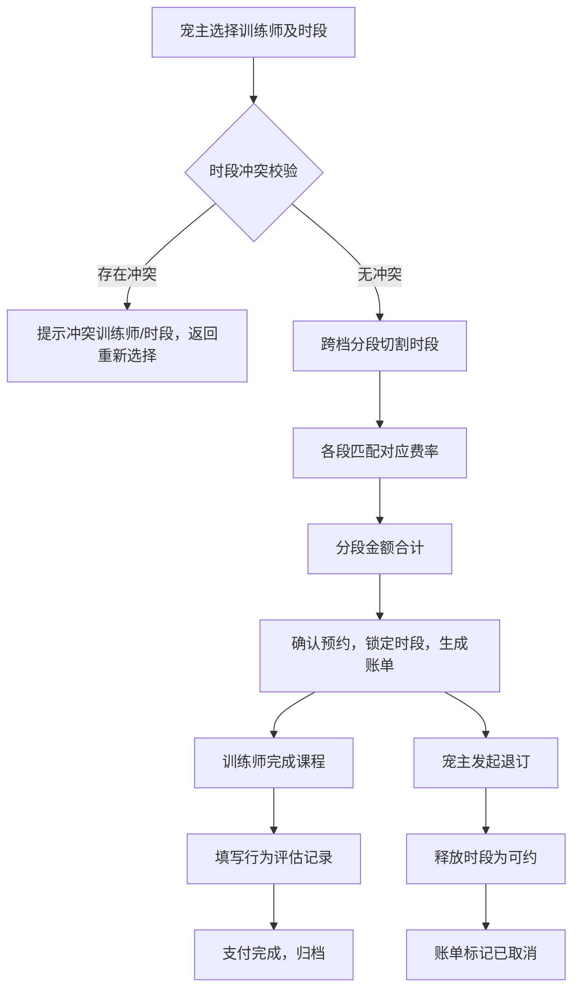

## 1. 产品概述

宠物训练课预约与计费管理系统，解决宠主预约训练课程的时段冲突、多费率分段计费、退订释放等核心问题。
- 核心用户：宠主（预约者）、训练师、管理员（运营）
- 市场价值：通过智能时段冲突校验与精准分段计费，提高训练资源利用率与收费透明度

## 2. 核心功能

### 2.1 用户角色

| 角色 | 注册方式 | 核心权限 |
|------|----------|----------|
| 管理员 | 系统预置 | 训练师建档、费率表维护、全量预约查看、账单管理 |
| 宠主 | 系统录入 | 浏览训练师排期、提交预约、退订、查看账单、记录行为评估 |
| 训练师 | 管理员建档 | 查看个人排期、查看预约信息、填写行为评估 |

### 2.2 功能模块

1. **训练排期模块**：训练师建档、训练师时段设置、排期日历视图、预约提交
2. **冲突校验模块**：时段重叠校验、预约冲突提示、退订时段释放、可约时段实时刷新
3. **时段计费模块**：时段费率表维护（高峰/平峰/夜间多档）、跨档时长拆分、分段金额合计
4. **账单生成模块**：预约账单生成、费用明细展示、行为评估记录、账单查询导出

### 2.3 页面详情

| 页面名称 | 模块名称 | 功能描述 |
|-----------|-------------|---------------------|
| 首页仪表盘 | 数据概览卡片 | 今日预约数、训练师在岗数、营收概览、本月新增评估 |
| 训练师管理 | 训练师列表 | 新增/编辑/停用训练师，专长标签、资历、每时段基础价格 |
| 训练师管理 | 训练师时段设置 | 按日/周设置训练师可约时段（上下班时间、午休、节假日） |
| 排期日历 | 周视图日历 | 按训练师维度展示排期，已约/空闲/冲突状态色块 |
| 预约管理 | 预约提交表单 | 选择宠主、训练师、时段、宠物信息，提交前冲突校验 |
| 预约管理 | 预约列表 | 全部预约记录，支持筛选、退订操作、冲突标记 |
| 费率管理 | 费率配置表 | 维护时段费率：时段区间、费率档位、倍率/单价、适用日期范围 |
| 计费试算 | 实时试算面板 | 选择训练师和时段后实时展示分段明细和合计金额 |
| 账单中心 | 账单列表 | 所有账单记录，状态标记（待支付/已支付/已取消） |
| 账单中心 | 账单详情 | 分段计费明细、预约信息、支付时间、行为评估关联 |
| 行为评估 | 评估记录 | 训练课后填写宠物行为表现、评分、下次建议课程 |

## 3. 核心流程

宠主预约流程：选择训练师 → 选择时段 → 系统校验时段冲突 → 若无冲突则分段计费试算 → 确认预约生成账单 → 锁定时段。

退订流程：找到预约 → 点击退订 → 释放时段回可约池 → 账单状态变更为已取消 → 记录退订日志。

冲突检测流程：提交预约时 → 提取训练师当日已有预约时段 → 时间区间重叠算法判定 → 存在重叠则拦截并提示冲突预约详情。

跨档计费流程：预约时段按时段费率切分点切割 → 每段匹配对应费率 → 单段时长×单价 → 各段金额求和 → 生成账单明细。

## 4. 用户界面设计

### 4.1 设计风格

- **主色调**：暖橙 #F97316（活力/宠物友好）
- **辅助色**：森绿 #10B981（健康/专业），奶油米 #FFFBEB（温暖底色）
- **中性色**：以 stone 色系为基础，深灰文字 + 浅灰卡片分割
- **按钮风格**：圆角 14px，微阴影 hover 上浮效果，渐变主按钮
- **字体**：标题使用 DM Serif Display（衬线优雅），正文使用 Outfit（现代无衬线）
- **布局风格**：卡片式布局 + 侧栏导航 + 顶部品牌条，页面宽松留白
- **图标/emoji**：lucide-react 线性图标 + 关键卡片搭配 paw/🐾 装饰元素

### 4.2 页面设计概述

| 页面名称 | 模块名称 | UI 元素 |
|-----------|-------------|----------|
| 仪表盘 | 数据概览卡片 | 4 张渐变统计卡，数字+趋势箭头，小 paw 角标装饰 |
| 排期日历 | 周视图日历 | 7 列栅格，训练师纵向分行，色块标识空闲/已约/冲突，hover 显示气泡 |
| 预约表单 | 时段选择器 | 双列选择（训练师下拉 + 时间区间），实时显示试算金额浮动条 |
| 费率配置 | 费率表 | 可编辑表格，每行时间段 + 档位标签 + 倍率输入，保存按钮固定底部 |
| 账单详情 | 费用明细 | 分段卡片堆叠展示，每段左侧竖条颜色对应费率档位 |
| 行为评估 | 评估表单 | 星级评分 + 标签多选 + 文本域，保存后进入账单侧栏 |

### 4.3 响应式

- 桌面优先（≥ 1280px），3 栏布局（侧栏导航 + 主内容 + 辅助信息）
- 平板（768–1279px）：侧栏收起为图标栏，主内容 2 栏
- 移动端（< 768px）：顶部汉堡菜单 + 单栏堆叠，日历切换为日视图

### 4.4 交互动效

- 页面加载：卡片 stagger 渐入（animation-delay 梯度）
- 日历时段：空闲时段 hover 放大 1.02 倍 + 橙色光晕
- 冲突提示：红色抖动动画 + 模态对话框展示冲突详情
- 分段计费：金额数字从 0 滚动到结算值
