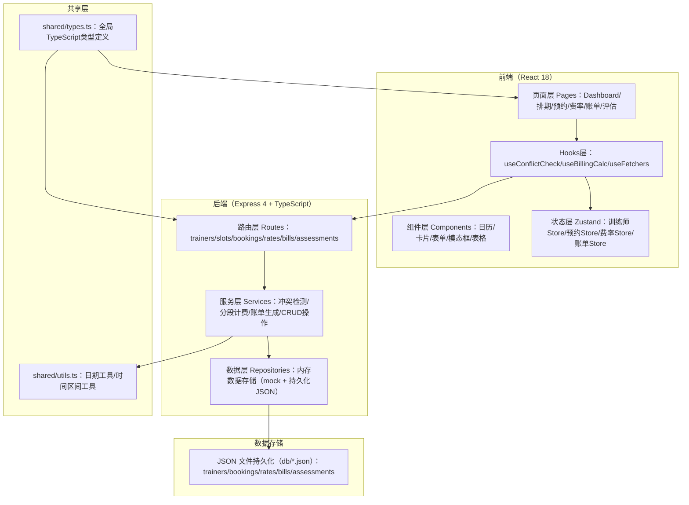
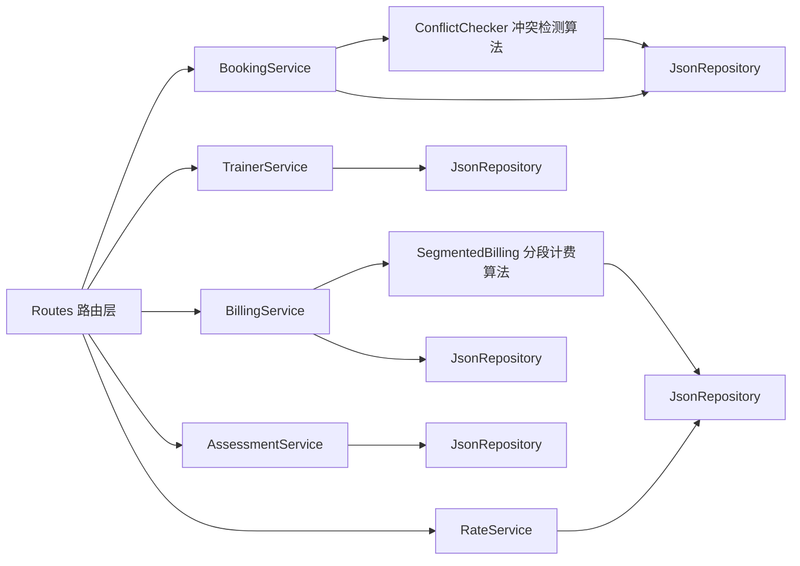

## 1. 架构设计



## 2. 技术说明

- **前端**：React@18 + TypeScript@5 + tailwindcss@3 + zustand@4 + react-router-dom@6 + lucide-react + vite@5
- **初始化工具**：vite-init（react-express-ts 模板）
- **后端**：Express@4 + TypeScript@5，ESM 模块化
- **数据库**：开发阶段使用 JSON 文件（lowdb 风格轻量存储），目录 `api/db/*.json`，预置 mock 数据
- **HTTP 客户端**：前端使用原生 fetch 封装（src/utils/http.ts）
- **时间处理**：date-fns 工具库

## 3. 路由定义

### 前端路由

| Route | 页面组件 | 用途 |
|-------|---------|------|
| `/dashboard` | Dashboard | 数据概览仪表盘 |
| `/trainers` | TrainerList | 训练师建档与列表 |
| `/trainers/:id/schedule` | TrainerSchedule | 训练师时段设置 |
| `/schedule` | ScheduleCalendar | 全局排期日历 |
| `/bookings` | BookingList | 预约列表与退订 |
| `/bookings/new` | BookingNew | 新建预约表单（含冲突校验+实时计费） |
| `/rates` | RateConfig | 时段费率配置表 |
| `/bills` | BillList | 账单列表 |
| `/bills/:id` | BillDetail | 账单详情（分段明细） |
| `/assessments` | AssessmentList | 行为评估记录列表 |
| `/assessments/new` | AssessmentNew | 新建行为评估 |

### 后端 API 路由

| Method | Route | 用途 |
|--------|-------|------|
| GET | `/api/trainers` | 获取训练师列表 |
| POST | `/api/trainers` | 新建训练师 |
| PUT | `/api/trainers/:id` | 更新训练师 |
| DELETE | `/api/trainers/:id` | 停用训练师 |
| GET | `/api/trainers/:id/slots` | 获取训练师某日/周可约时段 |
| POST | `/api/trainers/:id/slots` | 设置训练师可约时段 |
| GET | `/api/bookings` | 获取预约列表（支持查询参数过滤） |
| POST | `/api/bookings` | 提交预约（含冲突校验） |
| POST | `/api/bookings/check-conflict` | 纯冲突校验接口（表单预检用） |
| POST | `/api/bookings/:id/cancel` | 退订，释放时段 |
| GET | `/api/rates` | 获取费率配置 |
| PUT | `/api/rates` | 批量更新费率 |
| POST | `/api/billing/calculate` | 试算接口：输入时段返回分段明细+合计 |
| GET | `/api/bills` | 获取账单列表 |
| GET | `/api/bills/:id` | 获取账单详情 |
| POST | `/api/bills/:id/pay` | 标记账单已支付 |
| GET | `/api/assessments` | 获取评估记录列表 |
| POST | `/api/assessments` | 新建行为评估 |

## 4. API 核心数据结构（TypeScript 类型）

```typescript
// shared/types.ts
export interface Trainer {
  id: string;
  name: string;
  avatar?: string;
  specialties: string[];
  experienceYears: number;
  baseHourlyRate: number;
  status: 'active' | 'inactive';
  workSchedule: WorkSchedule;
}

export interface WorkSchedule {
  monday?: TimeRange[];
  tuesday?: TimeRange[];
  ...
  exceptions?: { date: string; ranges: TimeRange[] | null }[];
}

export interface TimeRange {
  start: string; // HH:mm
  end: string;   // HH:mm
}

export interface Booking {
  id: string;
  trainerId: string;
  ownerName: string;
  petName: string;
  petType: 'dog' | 'cat' | 'other';
  startAt: string; // ISO datetime
  endAt: string;   // ISO datetime
  status: 'confirmed' | 'completed' | 'cancelled';
  createdAt: string;
  cancelledAt?: string;
  billId?: string;
}

export interface RateTier {
  id: string;
  name: string;              // 高峰/平峰/夜间
  color: string;             // 主题色（UI展示）
  multiplier: number;        // 相对基础价倍率
  timeRanges: { start: string; end: string }[]; // 当日时段区间
  applicableWeekdays: number[]; // 0=Sun ... 6=Sat，空数组=全部
  priority: number;          // 冲突时优先级
}

export interface BillingSegment {
  startTime: string;
  endTime: string;
  durationMinutes: number;
  tierId: string;
  tierName: string;
  unitPrice: number;
  subtotal: number;
}

export interface BillingResult {
  segments: BillingSegment[];
  totalMinutes: number;
  totalAmount: number;
}

export interface Bill {
  id: string;
  bookingId: string;
  trainerId: string;
  segments: BillingSegment[];
  totalAmount: number;
  status: 'pending' | 'paid' | 'cancelled';
  paidAt?: string;
  createdAt: string;
}

export interface Assessment {
  id: string;
  bookingId: string;
  trainerId: string;
  petName: string;
  score: number; // 1-5
  tags: string[];
  notes: string;
  recommendations: string;
  createdAt: string;
}

export interface ConflictResult {
  hasConflict: boolean;
  conflictingBookings?: Booking[];
  message?: string;
}
```

## 5. 后端服务架构



## 6. 数据模型

### 6.1 ER 图

```mermaid
erDiagram
    TRAINER ||--o{ BOOKING : has
    TRAINER ||--o{ ASSESSMENT : writes
    BOOKING ||--|| BILL : generates
    BOOKING ||--o| ASSESSMENT : has
    RATE_TIER }o--..o{ BILL : "used in segments"

    TRAINER {
        string id PK
        string name
        string[] specialties
        int experienceYears
        decimal baseHourlyRate
        string status
        json workSchedule
    }
    BOOKING {
        string id PK
        string trainerId FK
        string ownerName
        string petName
        string petType
        datetime startAt
        datetime endAt
        string status
        string billId FK
    }
    BILL {
        string id PK
        string bookingId FK
        string trainerId FK
        json segments
        decimal totalAmount
        string status
    }
    RATE_TIER {
        string id PK
        string name
        string color
        decimal multiplier
        json timeRanges
        int[] weekdays
        int priority
    }
    ASSESSMENT {
        string id PK
        string bookingId FK
        string trainerId FK
        string petName
        int score
        string[] tags
        text notes
        text recommendations
    }
```

### 6.2 预置 Mock 数据说明

- **训练师**：5 位，专长包含"基础服从""行为纠正""幼犬启蒙""敏捷训练"等
- **费率档位**：4 档（早高峰 07-09 ×1.3 / 平峰 09-17 ×1.0 / 晚高峰 17-20 ×1.5 / 夜间 20-22 ×1.8）
- **预约**：预置 10+ 条已确认预约，含跨档案例、邻近冲突案例
- **账单**：对应预约生成账单，含分段明细
- **评估记录**：预置 5+ 条课后评估
